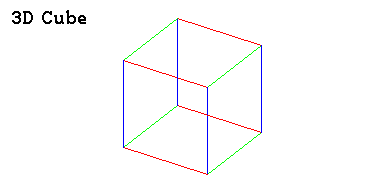

Casioplot for computers
=======================

Module ``casioplot`` from Casio calculator for Computers.

This can help to develop python programs in your computer and run it before you put it in your calculator.
Due to it's customization ability, this package can also be used as simple way to draw at a pixel level.

Installation
------------

.. code-block:: shell

    pip install casioplot

This module use python 3.11.

Need the module ``Pillow`` to work.

**Install Pillow:**

.. code-block:: shell

    pip install pillow

Usage example
-------------

Draw a single pixel
~~~~~~~~~~~~~~~~~~~

.. code-block:: python3

    from casioplot import *

    print(get_pixel(10, 10))
    red = (255, 0, 0)
    set_pixel(10, 10, red)
    print(get_pixel(10, 10))
    show_screen()  # Don't forget to show the screen to see the result.

.. code-block:: text

    (255, 255, 255)
    (255, 0, 0)

For more examples and usage, please refer to the `Docs <https://casioplot.readthedocs.io/en/latest/>`_.
There is also a demonstration of the package in the folder `demo <https://github.com/uniwix/casioplot/tree/master/demo>`_.

Development setup
-----------------

Nothing needed.

Release history
---------------

See `Github release page <https://github.com/uniwix/casioplot/releases>`_.

Meta
----

Uniwix - `uniwixu@gmail.com <uniwixu@gmail.com>`_

MiguelTorrinhaPereira - `miguel.torrinha.pereira+github@gmail.com <miguel.torrinha.pereira+github@gmail.com>`_

Distributed under the MIT license. See `LICENSE <https://github.com/uniwix/casioplot/blob/master/LICENSE>`_ for more information.

`<https://github.com/uniwix>`_

Contributing
------------

1. Fork it (`<https://github.com/uniwix/casioplot/fork>`_)
2. Create your feature branch (``git checkout -b feature/fooBar``)
3. Commit your changes (``git commit -am 'Add some fooBar'``)
4. Push to the branch (``git push origin feature/fooBar``)
5. Create a new Pull Request

v 3.2.0 - Uniwix - MiguelTorrinhaPereira
