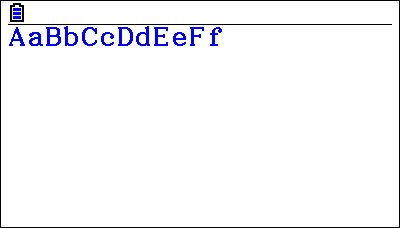

Examples
========

In all examples the settings come from the preset file ``fx-CG50.toml``.
If you copy this examples an run them without extra configuration you will be using the ``default.toml`` preset file which is different.

Draw a pixel
------------

.. code-block:: python3

    from casioplot import *

    red = (255, 0, 0)
    set_pixel(10, 10, red)
    show_screen()  # Don't forget to show the screen to see the result.

Result:
~~~~~~~

.. image:: images/pixel.png
    :alt: A single pixel on the screen

Draw a rectangle
----------------

.. code-block:: python3

    from casioplot import *

    def rectangle(start_x, start_y, end_x, end_y, color):
        width = abs(end_x - start_x)
        height = abs(end_y - start_y)
        for x in range(width + 1):
            for y in range(height + 1):
                set_pixel(start_x + x, start_y + y, color)

    red = (255, 0, 0)
    rectangle(10, 10, 200, 100, red)
    show_screen()  # Don't forget to show the screen to see the result.

Result:
~~~~~~~

.. image:: images/rectangle.png
    :alt: A red rectangle on a white screen

Get a pixel value
-----------------

.. code-block:: python3

    from casioplot import *

    def rectangle(start_x, start_y, end_x, end_y, color):
        x = abs(end_x - start_x)
        y = abs(end_y - start_y)
        for i in range(x + 1):
            for j in range(y + 1):
                set_pixel(i + start_x, j + start_y, color)

    red = (255, 0, 0)
    rectangle(10, 10, 200, 100, red)

    pixel_color = get_pixel(20, 20) 
    match pixel_color:
        case r, g, b:
            print('Red:  ', r)
            print('Green:', g)
            print('Blue: ', b)
        case None:
            print('Out of the screen.')

Result:
~~~~~~~

.. code-block:: text

    Red:   255
    Green: 0
    Blue:  0

Note that you don't need to show the screen to get the color of a pixel.

Clearing the screen
-------------------

.. code-block:: python3

   from casioplot import *

    def rectangle(start_x, start_y, end_x, end_y, color):
        x = abs(end_x - start_x)
        y = abs(end_y - start_y)
        for i in range(x + 1):
            for j in range(y + 1):
                set_pixel(i + start_x, j + start_y, color)
    
    red = (255, 0, 0)
    rectangle(10, 10, 200, 100, red)

    show_screen()
    clear_screen()
    show_screen()

Result:
~~~~~~~

First call of ``show_screen``:

.. image:: images/rectangle.png
    :alt: A red rectangle on a white screen

Second call of ``show_screen``:

.. image:: images/calculator.png
    :alt: A red rectangle on a white screen

Writing
-------

.. code-block:: python3

    from casioplot import *

    blue = (0, 0, 255)
    draw_string(0, 0, 'AaBbCcDdEeFf', blue,  "large")

    show_screen()

Result:
~~~~~~~

Demo
----

You can find more examples in the :file:`demo` directory in the source code.

.. image:: images/3D_cube.png
    :alt: A 3D cube

