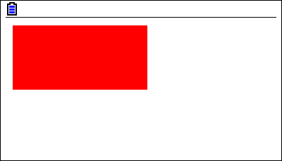

Examples
========

Draw a pixel
------------

.. code-block:: python

    from casioplot import *

    red = (255, 0, 0)
    set_pixel(10, 10, red)
    show_screen()  # Don't forget to show the screen to see the result.

Result:
~~~~~~~

.. image:: images/pixel.png
    :alt: A single pixel on the screen

Draw a rectangle
----------------

.. code-block:: python

    from casioplot import *

    def rectangle(start_x, start_y, end_x, end_y, color):
        x = abs(end_x - start_x)
        y = abs(end_y - start_y)
        for i in range(x + 1):
            for j in range(y + 1):
                set_pixel(i + start_x, j + start_y, color)

    red = (255, 0, 0)
    rectangle(10, 10, 200, 100, red)
    show_screen()  # Don't forget to show the screen to see the result.

Result:
~~~~~~~

Get a pixel value
-----------------

.. code-block:: python

    from casioplot import *

    def rectangle(start_x, start_y, end_x, end_y, color):
        x = abs(end_x - start_x)
        y = abs(end_y - start_y)
        for i in range(x + 1):
            for j in range(y + 1):
                set_pixel(i + start_x, j + start_y, color)

    red = (255, 0, 0)
    rectangle(10, 10, 200, 100, red)

    match get_pixel(20, 20):
        case r, g, b:
            print('Red:  ', r)
            print('Green:', g)
            print('Blue: ', b)
        case None:
            print('Out of the screen.')

Result:
~~~~~~~

.. code-block::

    Red:   255
    Green: 0
    Blue:  0

Note that you don't need to show the screen to get the color of a pixel.

More
----

You can find more examples in the ``demo`` directory in the source code.
