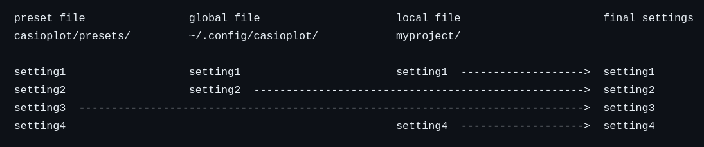

.. role:: toml(code)
   :language: toml

Settings
========

Settings can be used to control the size of the screen, margins, background image, saving options and more.

How to control the settings
---------------------------

The settings can be controled by a toml config file. 

Selection of the config file
----------------------------

When the package starts it searches for a config file, in the following order:

#. local file, a config file located in the same folder as the python program that is using the package. Must be named casioplot_config.toml.
#. global file, a config file located in the folder :file:`~/.config/casioplot`, there may be multiple global config files, in that case the first in alphabetical order will be picked.
#. :file:`default.toml`, a config file stored in the package, a preset file.

You must create the folder :file:`~/.config/casioplot` first to use global config files.

Available presets
~~~~~~~~~~~~~~~~~

The package comes with 4 preset files, :file:`default.toml`, :file:`fx-CG50.toml`, :file:`fx-CG50_AU.toml` and :file:`graph_90+e.toml`.
**fx-CG50**, **fx-CG50_AU** and **graph_90+e** have the exact same settings, the only reasson they are three instead of one is for better user experience.
Presets shoudn't be modified by the user.

:file:`default.toml`:

.. image:: images/default.png
    :alt: A completly white image

Calculator presets:

.. image:: images/calculator.png
    :alt: The empty screen of a casio calculator

Config file hierarchy
---------------------

Keep in mind this hierarchy that the package uses to search for config files, :menuselection:`local --> global --> presets`. This can be tought as the order of most custom config file to the lest custom.

Default to file
---------------

A config file may have the key :toml:`default_to`, this key is used to indicate
a default to file. If a settings is missing from a config file and that same settings
is set in the default to file that setting will be set to the value of the default to file.
A config file must only have as default file a config file less custom then tham. So a local
file can have a global or a preset, but a global can only have a preset file as default file.

A local config file may specify a global one that specifies a preset, creating a chain.
Image that there are only 4 settings, a chain could work like this:

We strongly recommend you to set default_to to a preset file in your config file. 
This will ensure that all the settings are set, so you don't get any errors when running your programs.

default_to key 
~~~~~~~~~~~~~~

To specify a default to file you can use the following syntax:
- global file: :file:`global/{file_name}`
- preset file: :file:`presets/{file_name}`
You must include the :file:`.toml` file extension.

So, for example, to specify your global file named :file:`my_global_config1.toml` do the following:

.. code-block:: toml

   # myproject/casioplot_config.toml
   default_to = "global/my_global_config1.toml"

Or to specify the preset :file:`fx-CG50.toml` file:

.. code-block:: toml

   # ~/.config/casioplot/my_global_config1.toml
   default_to = "presets/fx-CG50.toml"

If you were to create this two file and run a program in the :file:`myproject/` directory
it would have the settings of :file:`fx-CG50.toml`.

If :toml:`default_to` is set to :toml:`""` or isn't set there will be no default to file.
If you set :toml:`default_to` to :toml:`""` on a global file, you need to make sure that
all settings are set at least once.

Available settings
------------------

These are the content of :file:`default.toml`

Set the size of the canvas where you are able to draw.
Should not be used if :toml:`bg_image_is_set` is true,
since it will be automatically set to the size of the background image
minus the margins.

.. code-block:: toml

    [canvas]
    width = 400
    height = 200

Set the size of the margin around the canvas.
Useful if your background image has a border.
    
.. code-block:: toml

    [margins]
    left_margin = 5
    right_margin = 5
    top_margin = 5
    bottom_margin = 5

Set the background image.
If :toml:`bg_image_is_set` is set to :toml:`false`, the background image is ignored
You can select where you image is in the following way:
Use :file:`{image_name}` to select local images.
Use :file:`global/{image_name}` to select global images.
Use :file:`bg_images/{image_name}` to select preset images.
Include the extencion in the name.

.. code-block:: toml

    [background]
    bg_image_is_set = false
    # use this image if you don't want to have a background image and not use a default file
    background_image = "bg_images/blanck.png"

Show the screen with tkinter.

.. code-block:: toml

    [showing_screen]
    show_screen = true
    # Close the window at exit.
    close_window = true

Save the screen in the current directory.
If :toml:`save_multiple` is set to :toml:`false`, the screen will be saved at each
:py:func:`show_screen` call, overwriting the previous save,
the file name will be :file:`{image_name}.{image_format}`.
If :toml:`save_multiple` is set to :toml:`true`, the screen will be saved every time
:py:func:`show_screen` is called :toml:`save_rate` times,
and file name will be :file:`image_name{number}.image_format`
where ``number`` is the number of the save.

.. code-block:: toml

    [saving_screen]
    save_screen = false
    image_name = "casioplot"
    image_format = "png"
    save_multiple = false
    # be careful, with save_rate = 1 you can easily generate tens of thousand of images in a few seconds
    save_rate = 1

The Casio calculators don't have the same precision for colors as the computer
the option :toml:`correct_colors` makes the :py:func:`set_pixel` function correct the colors
to match what would happen in the calculators

.. code-block:: toml

    [colors]
    correct_colors = false

It could also be helpful to see `fx-CG50.toml <https://github.com/uniwix/casioplot/blob/master/casioplot/presets/fx-CG50.toml>`_.
It looks like this:

.. image:: images/calculator.png
    :alt: Empty casio calculator screen
